# --- Distributed Flow & Robustness ---

## 🔄 Distributed Workflow

1. **PC1 (Coordinator)**: Recibe inferencias de modelos grandes y coordina el procesamiento.
2. **PC2 (Worker)**: Procesa embeddings y modelos pequeños localmente. Reenvía inferencias de modelos grandes a PC1.
3. **Comunicación RPC**: Utiliza endpoints `/inference`, `/embed`, `/health`, `/status`.
4. **Manejo de errores**: Reintentos automáticos, logs detallados, reconexión si el nodo remoto no responde.
5. **Monitoreo**: Health checks periódicos y reconexión automática.

### Ejemplo de flujo:

```mermaid
sequenceDiagram
  participant User
  participant PC2
  participant PC1
  User->>PC2: Solicita embedding o inferencia
  PC2->>PC2: Procesa embedding/modelo pequeño
  PC2->>PC1: Reenvía inferencia de modelo grande
  PC1->>PC1: Procesa inferencia
  PC1-->>PC2: Devuelve resultado
  PC2-->>User: Devuelve resultado
```



### Endpoints principales:
- `/inference`: Inferencia distribuida
- `/embed`: Embedding local
- `/health`: Estado rápido
- `/status`: Estado detallado

### Robustez:
- Reintentos automáticos en RPC
- Logs detallados de cada llamada
- Reconexión automática si el nodo remoto falla
- Health checks periódicos

---
# 🖥️ Distributed Module - Multi-GPU Setup

This module enables two PCs with different GPUs to work together as a distributed AI system.

**PC1 (Coordinator):** RTX 3060 (12GB) - Large model inference  
**PC2 (Worker):** GTX 1660 Super (6GB) - Embeddings & small models  

## 📁 Files Overview

### Core Modules

| File | Purpose | LOC |
|------|---------|-----|
| `gpu_config.py` | GPU detection and configuration | 400+ |
| `rpc_communicator.py` | RPC protocol implementation | 350+ |
| `api_distributed.py` | FastAPI distributed backend | 450+ |
| `gpu_optimization.py` | GPU-specific optimizations | 350+ |
| `__init__.py` | Module initialization | 50+ |

### Setup Scripts

| File | Purpose |
|------|---------|
| `setup_pc1.sh` | Automated setup for PC1 (RTX 3060) |
| `setup_pc2.sh` | Automated setup for PC2 (GTX 1660 Super) |

### Generated Files (after setup)

```
pc1_config.json         # PC1 configuration
pc2_config.json         # PC2 configuration
run_pc1.sh             # PC1 startup script
run_pc2.sh             # PC2 startup script
test_pc1_setup.py      # PC1 verification
test_pc2_connection.py  # PC2 connection test
.env.pc1               # PC1 environment variables
.env.pc2               # PC2 environment variables
```

## 🚀 Quick Start

### 1. PC1 Setup (RTX 3060)

```bash
# In PC1 terminal:
bash distributed/setup_pc1.sh

# Test setup:
python3 distributed/test_pc1_setup.py

# Start server:
./run_pc1.sh
```

### 2. PC2 Setup (GTX 1660 Super)

```bash
# In PC2 terminal:
# First, get PC1's IP:
# In PC1: ifconfig | grep "inet "
# Example: 192.168.1.100

bash distributed/setup_pc2.sh 192.168.1.100

# Test connection:
python3 distributed/test_pc2_connection.py 192.168.1.100

# Start worker:
./run_pc2.sh
```

## 🧠 Architecture

```
┌─────────────────────────────────────────────────────────┐
│                    DISTRIBUTED SYSTEM                   │
├─────────────────────────────────────────────────────────┤
│                                                          │
│  PC1 (Coordinator)              PC2 (Worker)           │
│  ┌──────────────────┐           ┌──────────────────┐   │
│  │ FastAPI :8000    │◄─RPC/HTTP──│ FastAPI :8001    │   │
│  │ RTX 3060 - 12GB  │    REST    │ GTX 1660S - 6GB  │   │
│  │                  │────────────►│                  │   │
│  │ Large Models     │            │ Embeddings       │   │
│  │ - mistral-7b     │            │ - sentence-tf    │   │
│  │ - llama2-7b      │            │ Small Models     │   │
│  │ - neural-chat    │            │ - phi-2          │   │
│  └──────────────────┘            └──────────────────┘   │
│                                                          │
└─────────────────────────────────────────────────────────┘
```

## 📊 GPU Specifications

### RTX 3060 (PC1)
- **VRAM:** 12GB
- **CUDA Cores:** 3660
- **Boost Clock:** 2.5 GHz
- **Memory Bandwidth:** 360 GB/s
- **Quantization:** 4-bit
- **Max Model Size:** 13B parameters

### GTX 1660 Super (PC2)
- **VRAM:** 6GB
- **CUDA Cores:** 1408
- **Boost Clock:** 1.8 GHz
- **Memory Bandwidth:** 336 GB/s
- **Quantization:** 8-bit
- **Max Model Size:** 3.3B parameters

## 🔌 API Endpoints

### Health & Status
- `GET /health` - Health check
- `GET /status` - System status
- `GET /config` - System configuration
- `GET /models` - Available models

### Inference
- `POST /inference` - Run inference
  ```json
  {
    "prompt": "What is AI?",
    "max_tokens": 256,
    "temperature": 0.7,
    "gpu_index": 0
  }
  ```

### Embeddings
- `POST /embed` - Single embedding
  ```json
  {
    "text": "Hello world",
    "gpu_index": 0
  }
  ```

- `POST /embed-batch` - Batch embeddings
  ```json
  {
    "texts": ["Hello", "World"],
    "gpu_index": 0
  }
  ```

### RPC
- `POST /rpc` - RPC endpoint (internal)

## 🛠️ Troubleshooting

### Connection Issues
```bash
# Check PC1 is running:
curl http://192.168.1.100:8000/health

# Check connectivity:
ping 192.168.1.100

# Check port open:
nc -zv 192.168.1.100 8000
```

### GPU Issues
```bash
# Check CUDA:
python3 -c "import torch; print(torch.cuda.is_available())"

# Check GPU memory:
nvidia-smi

# Monitor GPU:
watch -n 1 nvidia-smi
```

### Performance Tuning
- Reduce batch size in `.env.pc2` if out of memory
- Increase `timeout` if RPC calls timeout
- Change port if already in use
- Enable `CUDA_LAUNCH_BLOCKING=true` for debugging

## 📈 Performance Targets

### Inference (PC1 - RTX 3060)
- **7B Model:** ~25 tokens/second
- **First Token Latency:** ~50ms
- **Batch Size:** 8

### Embeddings (PC2 - GTX 1660 Super)
- **Throughput:** ~800 vectors/second
- **Model:** sentence-transformers/all-MiniLM-L6-v2
- **Batch Size:** 8

## 🔐 Security Notes

⚠️ **For local network only**
- No authentication on endpoints
- Add API keys if exposed to internet
- Use TLS/HTTPS for remote access
- Restrict firewall to trusted IPs

## 📚 Documentation

- [QUICK_START_DISTRIBUTED.md](../QUICK_START_DISTRIBUTED.md) - Step-by-step guide
- [DISTRIBUTED_SETUP_SUMMARY.md](../DISTRIBUTED_SETUP_SUMMARY.md) - Complete overview
- [examples_distributed.py](../examples_distributed.py) - Usage examples

## 🚀 Next Steps

1. **Run Quick Start:** See `QUICK_START_DISTRIBUTED.md`
2. **Verify Setup:** `bash verify_distributed_setup.sh`
3. **Test Examples:** `python3 examples_distributed.py`
4. **Integrate Models:** Setup Ollama or LLaMA.cpp
5. **Add Persistence:** PostgreSQL for memory storage

## 💡 Key Concepts

### RPC (Remote Procedure Call)
PC2 can call functions on PC1 transparently:
```python
response = await coordinator.call_remote(
    "inference.query",
    prompt="Hello",
    max_tokens=256
)
```

### Auto Model Distribution
System automatically:
- Detects VRAM on each GPU
- Assigns appropriate models
- Routes requests to correct PC
- Manages quantization levels

### Asynchronous Communication
- Non-blocking RPC calls
- Concurrent request handling
- Timeout protection
- Automatic error recovery

## 📞 Support

For issues, check:
1. Python 3.8+ installed
2. PyTorch with CUDA support
3. GPU detected (nvidia-smi)
4. Network connectivity (ping)
5. Ports available (8000, 8001)
6. Logs in setup scripts

---

**Version:** 1.0.0  
**Created:** 12 FEB 2026  
**Status:** Production Ready ✅
